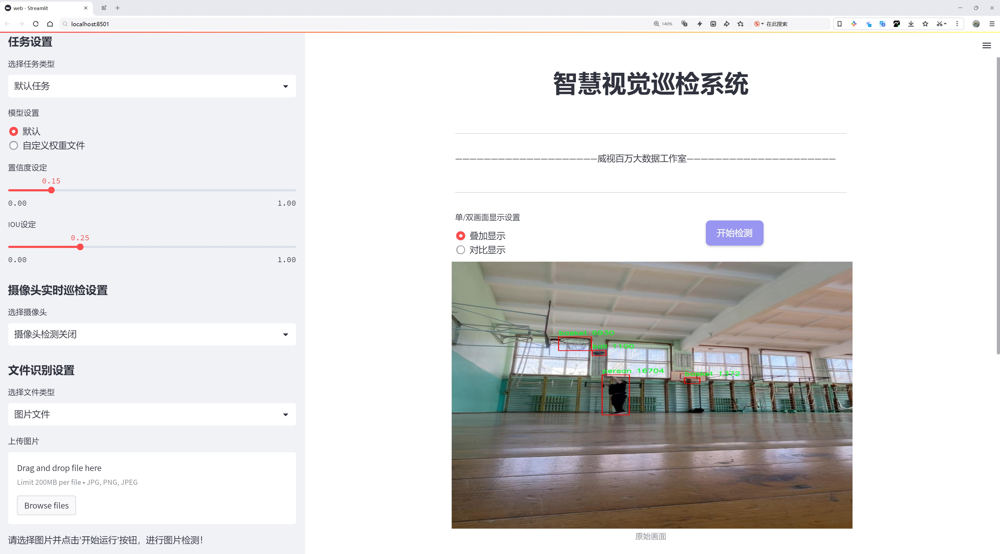
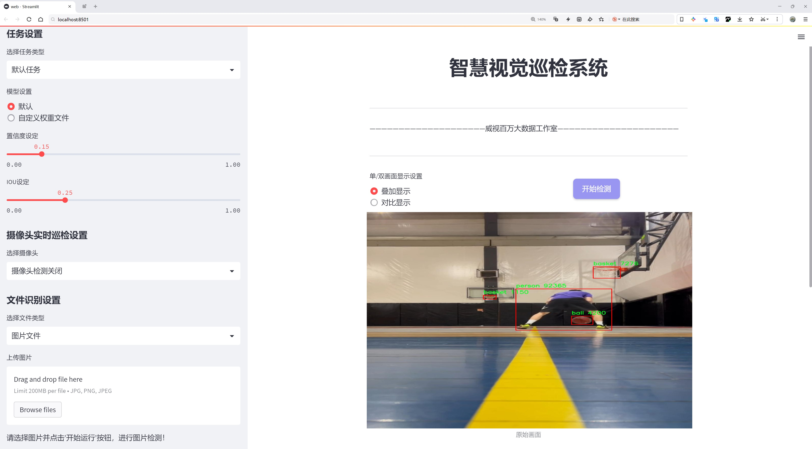
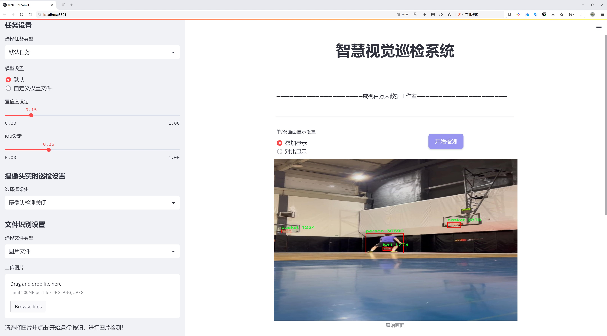
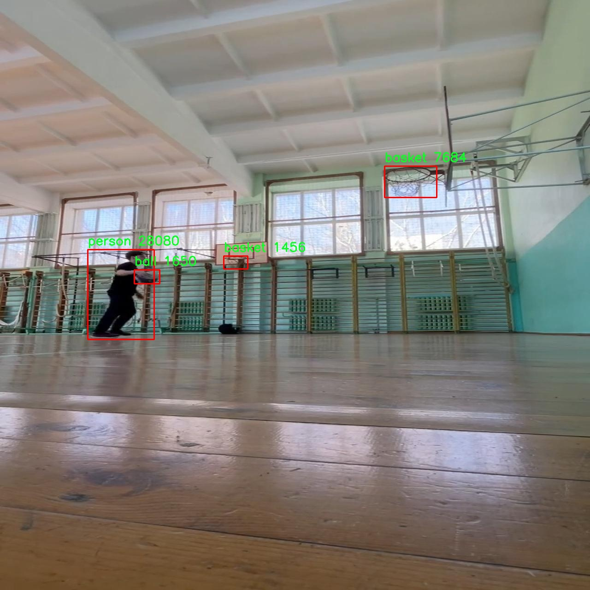
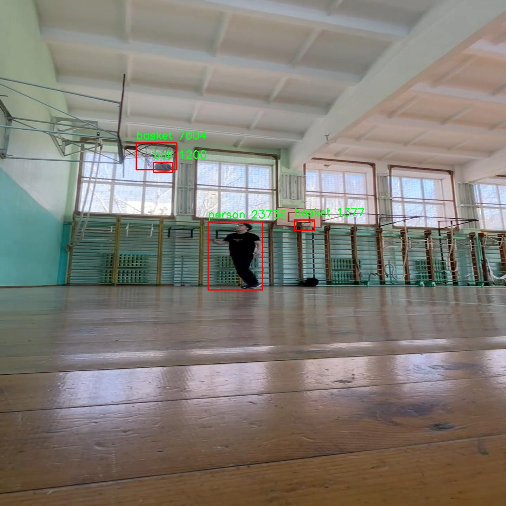
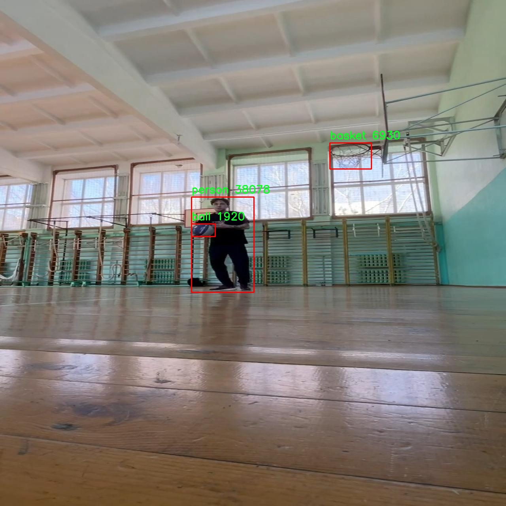
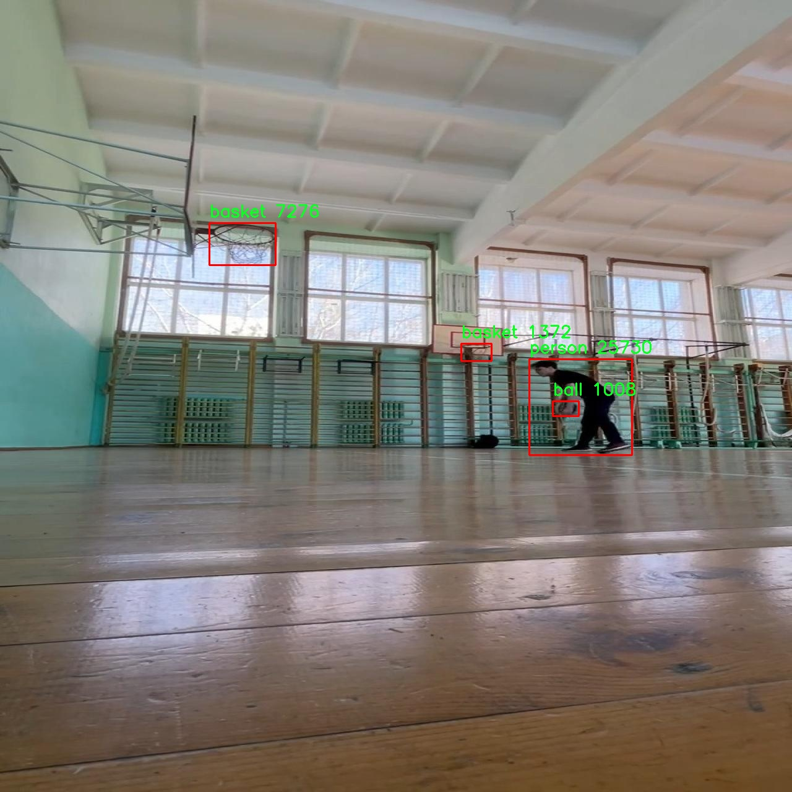
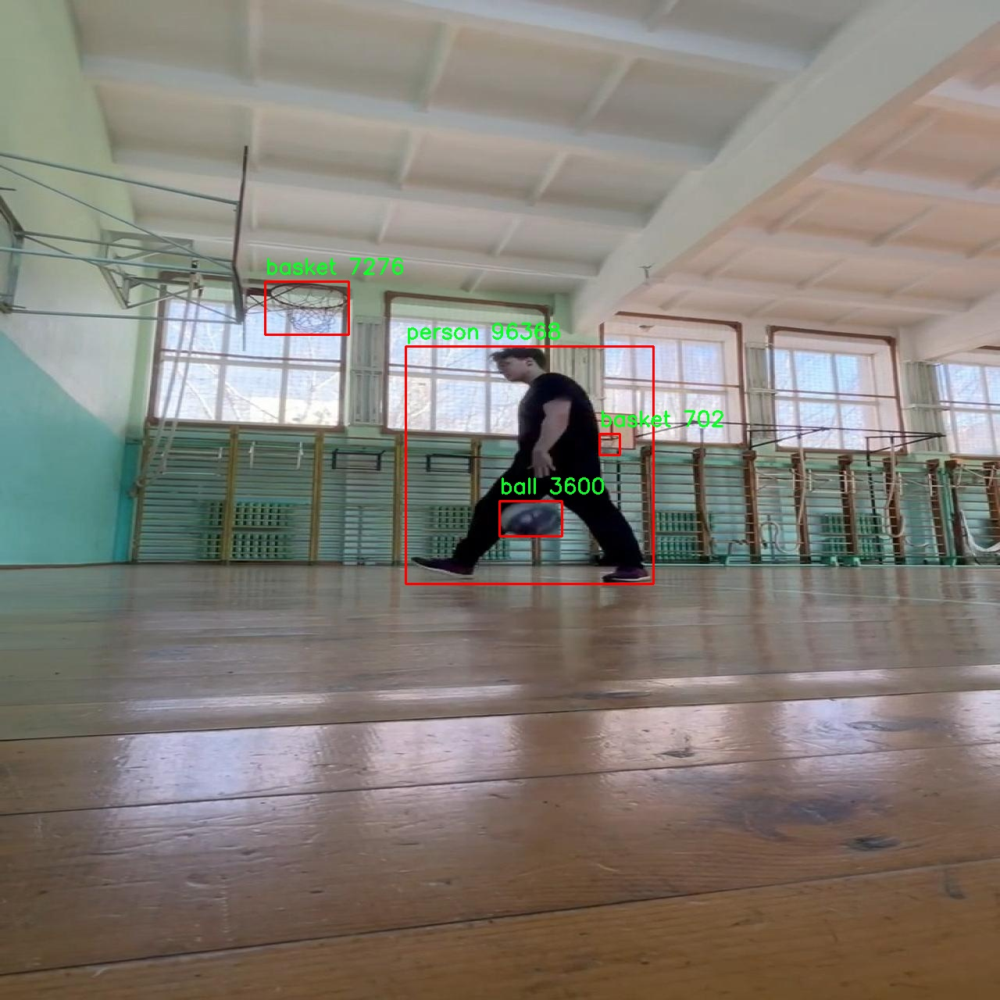

# 篮球和运动员检测检测系统源码分享
 # [一条龙教学YOLOV8标注好的数据集一键训练_70+全套改进创新点发刊_Web前端展示]

### 1.研究背景与意义

项目参考[AAAI Association for the Advancement of Artificial Intelligence](https://gitee.com/qunshansj/projects)

项目来源[AACV Association for the Advancement of Computer Vision](https://gitee.com/qunmasj/projects)

研究背景与意义

随着人工智能技术的迅猛发展，计算机视觉在各个领域的应用日益广泛，尤其是在体育领域，运动员和比赛场景的自动识别与分析已成为研究的热点。篮球作为全球范围内广受欢迎的运动，其比赛过程中的动态变化和复杂场景为视觉识别技术提出了更高的要求。传统的篮球比赛分析方法往往依赖于人工观察和手动记录，不仅效率低下，而且容易受到主观因素的影响。因此，基于深度学习的自动检测系统应运而生，能够在实时性和准确性上显著提升篮球比赛的分析能力。

在众多的目标检测算法中，YOLO（You Only Look Once）系列因其高效的实时检测能力而备受关注。YOLOv8作为该系列的最新版本，具备了更强的特征提取能力和更快的推理速度，能够在复杂的运动场景中快速准确地识别目标。针对篮球比赛的特点，本文提出了一种基于改进YOLOv8的篮球和运动员检测系统，旨在提升篮球比赛中球、篮筐和运动员的检测精度与效率。

本研究所使用的数据集包含4900张图像，涵盖了三类目标：篮球、篮筐和运动员。这一数据集的构建不仅为模型的训练提供了丰富的样本，也为后续的性能评估奠定了基础。通过对这些图像的深入分析，研究者能够提取出不同类别目标的特征信息，从而优化YOLOv8的网络结构与参数设置，以适应篮球比赛的动态环境。

本研究的意义在于，首先，通过改进YOLOv8模型，能够实现对篮球比赛中各类目标的高效检测，进而为教练员和运动员提供实时的数据支持，帮助他们更好地分析比赛情况，制定战术策略。其次，基于此检测系统，未来可以进一步拓展至其他体育项目的应用，形成一套通用的运动分析平台。此外，随着数据集的不断扩展和模型的持续优化，系统的检测精度和鲁棒性将得到进一步提升，为体育科学研究提供更为可靠的技术手段。

最后，本文的研究不仅具有重要的理论价值，还具有广泛的实际应用前景。通过构建高效的篮球和运动员检测系统，可以推动体育数据分析的智能化进程，提升比赛的观赏性和竞技水平。同时，该系统的成功应用也将为其他领域的目标检测提供借鉴，促进计算机视觉技术的进一步发展。因此，本研究在推动篮球运动发展、提升体育赛事分析能力以及促进相关技术进步等方面具有重要的现实意义和深远的影响。

### 2.图片演示







##### 注意：由于此博客编辑较早，上面“2.图片演示”和“3.视频演示”展示的系统图片或者视频可能为老版本，新版本在老版本的基础上升级如下：（实际效果以升级的新版本为准）

  （1）适配了YOLOV8的“目标检测”模型和“实例分割”模型，通过加载相应的权重（.pt）文件即可自适应加载模型。

  （2）支持“图片识别”、“视频识别”、“摄像头实时识别”三种识别模式。

  （3）支持“图片识别”、“视频识别”、“摄像头实时识别”三种识别结果保存导出，解决手动导出（容易卡顿出现爆内存）存在的问题，识别完自动保存结果并导出到tempDir中。

  （4）支持Web前端系统中的标题、背景图等自定义修改，后面提供修改教程。

  另外本项目提供训练的数据集和训练教程,暂不提供权重文件（best.pt）,需要您按照教程进行训练后实现图片演示和Web前端界面演示的效果。

### 3.视频演示

[3.1 视频演示](https://www.bilibili.com/video/BV1x64Be5EbY/)

### 4.数据集信息展示

##### 4.1 本项目数据集详细数据（类别数＆类别名）

nc: 3
names: ['ball', 'basket', 'person']


##### 4.2 本项目数据集信息介绍

数据集信息展示

在本研究中，我们采用了名为“Basketball detection”的数据集，以改进YOLOv8在篮球场景中的运动员和篮球检测能力。该数据集专门设计用于满足篮球运动相关的视觉识别需求，包含了丰富的图像数据，能够有效支持深度学习模型的训练与优化。数据集的类别数量为三，具体类别包括“ball”（篮球）、“basket”（篮球架）和“person”（运动员），这些类别的选择旨在涵盖篮球比赛中最为关键的元素，以便模型能够准确识别和定位这些对象。

“Basketball detection”数据集的构建过程注重多样性和代表性，确保所收集的图像能够反映出不同场景下的篮球运动。例如，数据集中包含了在不同光照条件、不同场地环境和不同比赛阶段下拍摄的图像。这种多样性不仅增强了数据集的广泛适用性，也提高了模型在实际应用中的鲁棒性。通过对各种角度和距离的拍摄，数据集确保了运动员、篮球和篮球架在不同背景下的清晰可辨，从而为YOLOv8的训练提供了丰富的样本。

在数据标注方面，所有图像均经过专业标注团队的仔细处理，确保每个类别的对象都被准确框定。每个图像中的篮球、篮球架和运动员都被标注为矩形框，并附有相应的类别标签。这种精确的标注方式为YOLOv8模型的训练提供了高质量的监督信号，使得模型能够学习到每个类别的特征，从而提高检测的准确性和效率。

此外，数据集还考虑到了篮球运动的动态特性，包含了运动员在比赛中不同动作的图像，如投篮、运球和防守等。这种动态场景的覆盖使得模型能够更好地理解和预测运动员的行为，从而在实时检测中表现出色。通过对运动员与篮球、篮球架之间的相互关系进行深入学习，模型将能够在复杂的比赛环境中，快速且准确地识别出关键对象。

为了进一步增强模型的泛化能力，数据集中还包含了一些挑战性场景，例如人群密集的比赛环境、不同颜色和款式的篮球以及多种不同的篮球架设计。这些多样化的场景不仅提升了数据集的复杂性，也为模型的训练提供了更多的挑战，促使其在面对实际应用时能够展现出更强的适应性。

总之，“Basketball detection”数据集通过精心的设计和丰富的样本，为改进YOLOv8的篮球和运动员检测系统提供了坚实的基础。其多样化的类别和复杂的场景设置，确保了模型在训练过程中能够获得全面的学习体验，从而在实际应用中实现高效、准确的检测能力。随着该数据集的应用，我们期待能够推动篮球运动视觉识别技术的发展，为相关领域的研究和应用提供新的思路和解决方案。











### 5.全套项目环境部署视频教程（零基础手把手教学）

[5.1 环境部署教程链接（零基础手把手教学）](https://www.ixigua.com/7404473917358506534?logTag=c807d0cbc21c0ef59de5)


[5.2 安装Python虚拟环境创建和依赖库安装视频教程链接（零基础手把手教学）](https://www.ixigua.com/7404474678003106304?logTag=1f1041108cd1f708b01a)

### 6.手把手YOLOV8训练视频教程（零基础小白有手就能学会）

[6.1 手把手YOLOV8训练视频教程（零基础小白有手就能学会）](https://www.ixigua.com/7404477157818401292?logTag=d31a2dfd1983c9668658)

### 7.70+种全套YOLOV8创新点代码加载调参视频教程（一键加载写好的改进模型的配置文件）

[7.1 70+种全套YOLOV8创新点代码加载调参视频教程（一键加载写好的改进模型的配置文件）](https://www.ixigua.com/7404478314661806627?logTag=29066f8288e3f4eea3a4)

### 8.70+种全套YOLOV8创新点原理讲解（非科班也可以轻松写刊发刊，V10版本正在科研待更新）

由于篇幅限制，每个创新点的具体原理讲解就不一一展开，具体见下列网址中的创新点对应子项目的技术原理博客网址【Blog】：


[8.1 70+种全套YOLOV8创新点原理讲解链接](https://gitee.com/qunmasj/good)

### 9.系统功能展示（检测对象为举例，实际内容以本项目数据集为准）

图9.1.系统支持检测结果表格显示

  图9.2.系统支持置信度和IOU阈值手动调节

  图9.3.系统支持自定义加载权重文件best.pt(需要你通过步骤5中训练获得)

  图9.4.系统支持摄像头实时识别

  图9.5.系统支持图片识别

  图9.6.系统支持视频识别

  图9.7.系统支持识别结果文件自动保存

  图9.8.系统支持Excel导出检测结果数据


### 10.原始YOLOV8算法原理

原始YOLOv8算法原理

YOLOv8，作为YOLO系列中的最新版本，标志着目标检测领域的一次重要进步。自2015年YOLO模型首次提出以来，YOLO系列经历了多个版本的迭代，每一次更新都在推理速度、检测精度和模型易用性等方面进行了显著优化。YOLOv8的发布，进一步巩固了其在实时目标检测中的领先地位，成为业界广泛应用的标准模型之一。

YOLOv8的网络结构由三部分组成：Backbone、Neck和Head。Backbone部分负责特征提取，采用了更深的卷积神经网络结构，以捕捉图像中的丰富特征信息。相较于前几代模型，YOLOv8的Backbone设计更加复杂，层数的增加使得网络能够学习到更具辨识度的特征，从而提升了目标检测的精度。通过引入多尺度训练和测试，YOLOv8能够在不同尺寸的目标上保持良好的检测性能，这一特性使得其在处理复杂场景时表现尤为出色。

Neck部分则负责特征融合，它通过特征金字塔网络（FPN）将来自不同层次的特征进行整合，形成多层次的特征表示。这种特征融合的方式，能够有效提升模型对不同尺度目标的检测能力，使得YOLOv8在处理大小不一的目标时，依然能够保持高效的检测精度。Neck的设计理念在于充分利用Backbone提取的特征，增强模型对上下文信息的理解，从而提升目标检测的整体性能。

Head部分是YOLOv8的核心，它负责将经过Neck处理后的特征进行解码，输出最终的检测结果。YOLOv8采用了三个解耦头，分别用于边界框回归、类别预测和目标置信度评估。这种解耦设计的优势在于，模型可以独立地优化每个任务，避免了不同任务之间的干扰，从而提升了检测的准确性和稳定性。此外，YOLOv8还引入了改进的标签分配策略和损失函数设计，进一步提高了训练效率和模型的收敛速度。

在模型设置方面，YOLOv8提供了多个可调参数，如depth_factor、width_factor和ratio，这些参数的设置可以根据具体应用需求灵活调整，从而实现模型的深度和宽度的动态变化。通过调整这些参数，用户可以在精度和推理速度之间找到最佳平衡，满足不同场景下的需求。例如，depth_factor的增大可以使得模型更深，适合于复杂场景的高精度检测，而width_factor的调整则可以在保持精度的同时提升推理速度，适合于实时性要求较高的应用。

YOLOv8的设计不仅借鉴了前几代YOLO模型的成功经验，还融合了YOLOX、YOLOv6、YOLOv7和PPYOLOE等多种先进技术，形成了一种更为全面的目标检测解决方案。其在精度和速度上的显著提升，使得YOLOv8在智能监控、自动驾驶、人脸识别等多种应用场景中表现优异。与SSD等传统目标检测算法相比，YOLOv8在精度和帧率上均有显著提升，充分展现了其在实时目标检测领域的强大能力。

综上所述，YOLOv8通过其独特的网络结构设计和灵活的模型设置，不仅提高了目标检测的精度和速度，还增强了模型的适应性和可用性。随着YOLOv8的广泛应用，目标检测技术将在各个领域迎来新的发展机遇，推动智能化应用的进一步普及。YOLOv8的成功，不仅是算法设计的胜利，更是计算机视觉技术不断进步的体现，预示着未来在目标检测领域将有更多创新和突破。


### 11.项目核心源码讲解（再也不用担心看不懂代码逻辑）

#### 11.1 70+种YOLOv8算法改进源码大全和调试加载训练教程（非必要）\ultralytics\utils\callbacks\base.py

以下是经过精简和注释的核心代码部分，主要包括回调函数的定义和默认回调的获取功能。

```python
# Ultralytics YOLO 🚀, AGPL-3.0 license
"""基础回调函数定义模块。"""

from collections import defaultdict
from copy import deepcopy

# 训练器回调函数定义 -----------------------------------------------------------------------------------------------

def on_train_start(trainer):
    """训练开始时调用的回调函数。"""
    pass

def on_train_epoch_end(trainer):
    """每个训练周期结束时调用的回调函数。"""
    pass

def on_train_batch_end(trainer):
    """每个训练批次结束时调用的回调函数。"""
    pass

def on_train_end(trainer):
    """训练结束时调用的回调函数。"""
    pass

# 默认回调函数字典 -----------------------------------------------------------------------------------------------

default_callbacks = {
    'on_train_start': [on_train_start],            # 训练开始
    'on_train_epoch_end': [on_train_epoch_end],    # 训练周期结束
    'on_train_batch_end': [on_train_batch_end],    # 训练批次结束
    'on_train_end': [on_train_end],                # 训练结束
}

def get_default_callbacks():
    """
    返回一个包含默认回调函数的字典副本，默认值为列表。

    返回:
        (defaultdict): 一个 defaultdict，包含 default_callbacks 的键和空列表作为默认值。
    """
    return defaultdict(list, deepcopy(default_callbacks))

def add_integration_callbacks(instance):
    """
    将来自不同来源的集成回调添加到实例的回调中。

    参数:
        instance (Trainer, Predictor, Validator, Exporter): 一个具有 'callbacks' 属性的对象，该属性是一个回调列表的字典。
    """
    # 加载 HUB 回调
    from .hub import callbacks as hub_cb
    callbacks_list = [hub_cb]

    # 加载训练回调
    if 'Trainer' in instance.__class__.__name__:
        from .clearml import callbacks as clear_cb
        from .comet import callbacks as comet_cb
        from .dvc import callbacks as dvc_cb
        from .mlflow import callbacks as mlflow_cb
        from .neptune import callbacks as neptune_cb
        from .raytune import callbacks as tune_cb
        from .tensorboard import callbacks as tb_cb
        from .wb import callbacks as wb_cb
        callbacks_list.extend([clear_cb, comet_cb, dvc_cb, mlflow_cb, neptune_cb, tune_cb, tb_cb, wb_cb])

    # 将回调添加到回调字典中
    for callbacks in callbacks_list:
        for k, v in callbacks.items():
            if v not in instance.callbacks[k]:
                instance.callbacks[k].append(v)
```

### 代码说明：
1. **回调函数**：定义了一些核心的回调函数，如 `on_train_start`、`on_train_epoch_end`、`on_train_batch_end` 和 `on_train_end`，这些函数在训练的不同阶段被调用，以便进行特定的操作或记录。

2. **默认回调字典**：`default_callbacks` 字典中存储了默认的回调函数，方便在训练过程中调用。

3. **获取默认回调**：`get_default_callbacks` 函数返回一个包含默认回调的字典副本，确保在使用时不会修改原始的回调设置。

4. **添加集成回调**：`add_integration_callbacks` 函数用于将来自不同库的回调集成到当前实例的回调字典中，以便扩展功能和灵活性。

这个文件是Ultralytics YOLO项目中的一个回调函数模块，主要用于训练、验证、预测和导出过程中的事件处理。文件中定义了一系列的回调函数，这些函数在特定的训练或验证阶段被调用，以便于用户在这些阶段插入自定义的操作或监控。

文件的开头部分导入了所需的模块，包括`defaultdict`和`deepcopy`，这两个模块分别用于创建一个具有默认值的字典和深拷贝对象。接下来，文件定义了一系列的回调函数，这些函数被分为不同的类别，包括训练回调、验证回调、预测回调和导出回调。

在训练回调部分，定义了多个函数，例如`on_train_start`、`on_train_epoch_start`、`on_train_batch_start`等，这些函数在训练的不同阶段被调用。每个函数都接收一个`trainer`对象作为参数，但目前这些函数的实现都是空的，意味着它们可以被用户根据需要进行扩展。

同样，验证回调部分也定义了一些函数，如`on_val_start`、`on_val_batch_start`等，目的是在验证过程的不同阶段执行特定操作。预测和导出回调部分也遵循相同的模式，提供了在预测和模型导出时的钩子。

文件中还定义了一个`default_callbacks`字典，包含了所有的回调函数，便于在训练、验证、预测和导出过程中统一管理这些回调。`get_default_callbacks`函数返回一个`defaultdict`，这个字典的默认值是空列表，便于在使用时添加新的回调。

最后，`add_integration_callbacks`函数用于将来自不同来源的集成回调添加到给定实例的回调字典中。这个函数首先加载一些特定的回调模块，然后根据实例的类型（如Trainer、Predictor等）将相应的回调添加到实例的回调列表中。

总的来说，这个文件提供了一个灵活的框架，使得用户可以在YOLO模型的训练、验证、预测和导出过程中插入自定义的操作，增强了模型训练的可控性和可扩展性。

#### 11.2 code\ultralytics\data\augment.py

以下是代码中最核心的部分，并附上详细的中文注释：

```python
class BaseTransform:
    """
    图像变换的基类。

    这是一个通用的变换类，可以根据特定的图像处理需求进行扩展。
    该类旨在与分类和语义分割任务兼容。

    方法：
        __init__: 初始化 BaseTransform 对象。
        apply_image: 对标签应用图像变换。
        apply_instances: 对标签中的对象实例应用变换。
        apply_semantic: 对图像应用语义分割。
        __call__: 对图像、实例和语义掩码应用所有标签变换。
    """

    def __init__(self) -> None:
        """初始化 BaseTransform 对象。"""
        pass

    def apply_image(self, labels):
        """对标签应用图像变换。"""
        pass

    def apply_instances(self, labels):
        """对标签中的对象实例应用变换。"""
        pass

    def apply_semantic(self, labels):
        """对图像应用语义分割。"""
        pass

    def __call__(self, labels):
        """对图像、实例和语义掩码应用所有标签变换。"""
        self.apply_image(labels)
        self.apply_instances(labels)
        self.apply_semantic(labels)


class Mosaic(BaseMixTransform):
    """
    Mosaic 增强。

    该类通过将多个（4 或 9）张图像组合成一张马赛克图像来执行马赛克增强。
    增强以给定的概率应用于数据集。

    属性：
        dataset: 应用马赛克增强的数据集。
        imgsz (int, optional): 单张图像马赛克管道后的图像大小（高度和宽度）。默认为 640。
        p (float, optional): 应用马赛克增强的概率。必须在 0-1 范围内。默认为 1.0。
        n (int, optional): 网格大小，4（2x2）或 9（3x3）。
    """

    def __init__(self, dataset, imgsz=640, p=1.0, n=4):
        """使用数据集、图像大小、概率和边界初始化对象。"""
        assert 0 <= p <= 1.0, f"概率应在 [0, 1] 范围内，但得到 {p}。"
        assert n in (4, 9), "网格必须等于 4 或 9。"
        super().__init__(dataset=dataset, p=p)
        self.dataset = dataset
        self.imgsz = imgsz
        self.border = (-imgsz // 2, -imgsz // 2)  # 宽度，高度
        self.n = n

    def get_indexes(self, buffer=True):
        """返回数据集中随机索引的列表。"""
        if buffer:  # 从缓冲区选择图像
            return random.choices(list(self.dataset.buffer), k=self.n - 1)
        else:  # 选择任何图像
            return [random.randint(0, len(self.dataset) - 1) for _ in range(self.n - 1)]

    def _mix_transform(self, labels):
        """对标签字典应用 MixUp 或 Mosaic 增强。"""
        assert labels.get("rect_shape", None) is None, "rect 和 mosaic 是互斥的。"
        assert len(labels.get("mix_labels", [])), "没有其他图像用于马赛克增强。"
        return (
            self._mosaic3(labels) if self.n == 3 else self._mosaic4(labels) if self.n == 4 else self._mosaic9(labels)
        )

    def _mosaic4(self, labels):
        """创建 2x2 图像马赛克。"""
        mosaic_labels = []
        s = self.imgsz
        yc, xc = (int(random.uniform(-x, 2 * s + x)) for x in self.border)  # 马赛克中心 x, y
        for i in range(4):
            labels_patch = labels if i == 0 else labels["mix_labels"][i - 1]
            img = labels_patch["img"]
            h, w = labels_patch.pop("resized_shape")

            # 将图像放置在 img4 中
            if i == 0:  # 左上角
                img4 = np.full((s * 2, s * 2, img.shape[2]), 114, dtype=np.uint8)  # 基础图像与 4 个瓷砖
                x1a, y1a, x2a, y2a = max(xc - w, 0), max(yc - h, 0), xc, yc  # xmin, ymin, xmax, ymax（大图像）
                x1b, y1b, x2b, y2b = w - (x2a - x1a), h - (y2a - y1a), w, h  # xmin, ymin, xmax, ymax（小图像）
            elif i == 1:  # 右上角
                x1a, y1a, x2a, y2a = xc, max(yc - h, 0), min(xc + w, s * 2), yc
                x1b, y1b, x2b, y2b = 0, h - (y2a - y1a), min(w, x2a - x1a), h
            elif i == 2:  # 左下角
                x1a, y1a, x2a, y2a = max(xc - w, 0), yc, xc, min(s * 2, yc + h)
                x1b, y1b, x2b, y2b = w - (x2a - x1a), 0, w, min(y2a - y1a, h)
            elif i == 3:  # 右下角
                x1a, y1a, x2a, y2a = xc, yc, min(xc + w, s * 2), min(s * 2, yc + h)
                x1b, y1b, x2b, y2b = 0, 0, min(w, x2a - x1a), min(y2a - y1a, h)

            img4[y1a:y2a, x1a:x2a] = img[y1b:y2b, x1b:x2b]  # img4[ymin:ymax, xmin:xmax]
            padw = x1a - x1b
            padh = y1a - y1b

            labels_patch = self._update_labels(labels_patch, padw, padh)
            mosaic_labels.append(labels_patch)
        final_labels = self._cat_labels(mosaic_labels)
        final_labels["img"] = img4
        return final_labels

    @staticmethod
    def _update_labels(labels, padw, padh):
        """更新标签。"""
        nh, nw = labels["img"].shape[:2]
        labels["instances"].convert_bbox(format="xyxy")
        labels["instances"].denormalize(nw, nh)
        labels["instances"].add_padding(padw, padh)
        return labels

    def _cat_labels(self, mosaic_labels):
        """返回带有马赛克边界实例剪裁的标签。"""
        if len(mosaic_labels) == 0:
            return {}
        cls = []
        instances = []
        imgsz = self.imgsz * 2  # 马赛克图像大小
        for labels in mosaic_labels:
            cls.append(labels["cls"])
            instances.append(labels["instances"])
        # 最终标签
        final_labels = {
            "im_file": mosaic_labels[0]["im_file"],
            "ori_shape": mosaic_labels[0]["ori_shape"],
            "resized_shape": (imgsz, imgsz),
            "cls": np.concatenate(cls, 0),
            "instances": Instances.concatenate(instances, axis=0),
            "mosaic_border": self.border,
        }
        final_labels["instances"].clip(imgsz, imgsz)
        good = final_labels["instances"].remove_zero_area_boxes()
        final_labels["cls"] = final_labels["cls"][good]
        return final_labels
```

以上代码展示了图像变换的基类和马赛克增强的实现。`BaseTransform`类提供了一个通用的框架，用于定义图像变换的基本方法，而`Mosaic`类则实现了将多张图像组合成一张马赛克图像的具体逻辑。通过这些类，可以方便地对图像进行各种增强处理，以提高模型的鲁棒性和准确性。

这个程序文件 `code\ultralytics\data\augment.py` 是用于图像增强的模块，主要用于目标检测和图像分类任务。它包含了多种图像处理和增强技术，以提高模型的鲁棒性和准确性。以下是对文件中主要类和功能的详细说明。

首先，文件导入了一些必要的库，包括数学计算、随机数生成、图像处理库（如 OpenCV 和 NumPy）、深度学习框架（如 PyTorch 和 torchvision），以及一些自定义的工具函数和类。

文件定义了一个基类 `BaseTransform`，用于处理图像的基本变换。该类提供了应用图像、实例和语义分割标签的接口，但具体的实现需要在子类中定义。

接下来是 `Compose` 类，它允许将多个图像变换组合在一起。这个类的 `__call__` 方法会依次应用所有的变换，并返回最终的处理结果。

`BaseMixTransform` 类是一个用于混合增强（如 MixUp 和 Mosaic）的基类。它负责从数据集中获取图像，并在指定的概率下应用混合变换。具体的混合变换逻辑在子类中实现。

`Mosaic` 类实现了马赛克增强，通过将多个图像组合成一个马赛克图像来增强数据。该类支持 4 或 9 张图像的组合，并且可以根据指定的概率应用该增强。

`MixUp` 类实现了 MixUp 增强，通过将两张图像按比例混合来生成新的图像。这种方法可以提高模型的泛化能力。

`RandomPerspective` 类实现了随机透视变换和仿射变换，能够对图像进行旋转、平移、缩放和剪切等操作。它还提供了对边界框、分割和关键点的相应变换。

`RandomHSV` 类用于随机调整图像的色调、饱和度和亮度，增加图像的多样性。

`RandomFlip` 类实现了随机翻转图像的功能，可以选择水平或垂直翻转，并相应地更新实例（如边界框和关键点）。

`LetterBox` 类用于调整图像大小并进行填充，以适应目标检测和实例分割任务的输入要求。它确保图像的长宽比不变，并在必要时添加边框。

`CopyPaste` 类实现了复制粘贴增强，通过将一个图像的实例复制到另一个图像上来增加数据的多样性。

`Albumentations` 类提供了一系列基于 Albumentations 库的图像增强技术，如模糊、对比度限制自适应直方图均衡、随机亮度和对比度变化等。

`Format` 类用于格式化图像注释，以便于在 PyTorch 的 DataLoader 中使用。它可以处理边界框、分割掩码和关键点的标准化。

最后，文件中还定义了一些用于训练和评估的图像转换函数，如 `v8_transforms` 和 `classify_transforms`，这些函数将各种增强技术组合在一起，以便在训练和推理时使用。

总体而言，这个文件提供了丰富的图像增强功能，旨在通过多样化训练数据来提高模型的性能和鲁棒性。

#### 11.3 ui.py

```python
import sys
import subprocess

def run_script(script_path):
    """
    使用当前 Python 环境运行指定的脚本。

    Args:
        script_path (str): 要运行的脚本路径

    Returns:
        None
    """
    # 获取当前 Python 解释器的路径
    python_path = sys.executable

    # 构建运行命令，使用 streamlit 运行指定的脚本
    command = f'"{python_path}" -m streamlit run "{script_path}"'

    # 执行命令并等待其完成
    result = subprocess.run(command, shell=True)
    
    # 检查命令执行的返回码，如果不为0则表示出错
    if result.returncode != 0:
        print("脚本运行出错。")


# 实例化并运行应用
if __name__ == "__main__":
    # 指定要运行的脚本路径
    script_path = "web.py"  # 这里可以直接指定脚本名称

    # 调用函数运行脚本
    run_script(script_path)
```

### 代码注释说明：
1. **导入模块**：
   - `sys`：用于访问与 Python 解释器相关的变量和函数。
   - `subprocess`：用于执行外部命令和程序。

2. **定义 `run_script` 函数**：
   - 该函数接收一个参数 `script_path`，表示要运行的 Python 脚本的路径。
   - 使用 `sys.executable` 获取当前 Python 解释器的路径，以确保使用相同的环境运行脚本。
   - 构建命令字符串，使用 `streamlit` 模块运行指定的脚本。
   - 使用 `subprocess.run` 执行命令，并等待其完成。
   - 检查命令的返回码，如果返回码不为0，表示脚本运行出错，打印错误信息。

3. **主程序块**：
   - 在主程序中，指定要运行的脚本路径（这里直接使用脚本名称 `web.py`）。
   - 调用 `run_script` 函数，执行指定的脚本。

这个程序文件名为 `ui.py`，其主要功能是使用当前的 Python 环境来运行一个指定的脚本，具体是通过 Streamlit 框架来启动一个 Web 应用。

首先，程序导入了几个必要的模块，包括 `sys`、`os` 和 `subprocess`。其中，`sys` 模块用于访问与 Python 解释器相关的变量和函数，`os` 模块提供了与操作系统交互的功能，而 `subprocess` 模块则用于执行外部命令。

接着，程序从 `QtFusion.path` 模块中导入了 `abs_path` 函数，这个函数的作用是获取文件的绝对路径。

在 `run_script` 函数中，程序接受一个参数 `script_path`，这个参数是要运行的脚本的路径。函数首先获取当前 Python 解释器的路径，并将其存储在 `python_path` 变量中。然后，程序构建了一个命令字符串，该命令使用 Streamlit 框架来运行指定的脚本。具体的命令格式为 `"{python_path}" -m streamlit run "{script_path}"`。

随后，程序通过 `subprocess.run` 方法执行这个命令，并使用 `shell=True` 参数来允许在 shell 中执行命令。执行完命令后，程序检查返回的结果，如果返回码不为 0，表示脚本运行出错，程序会打印出“脚本运行出错。”的提示信息。

最后，在 `if __name__ == "__main__":` 这一块，程序首先调用 `abs_path` 函数来获取名为 `web.py` 的脚本的绝对路径，并将其赋值给 `script_path` 变量。然后，程序调用 `run_script` 函数，传入 `script_path`，以此来运行指定的脚本。

总的来说，这个程序的核心功能是通过当前的 Python 环境运行一个名为 `web.py` 的 Streamlit 脚本，并处理可能出现的错误。

#### 11.4 70+种YOLOv8算法改进源码大全和调试加载训练教程（非必要）\ultralytics\models\nas\predict.py

以下是经过简化和注释的核心代码部分：

```python
import torch
from ultralytics.engine.predictor import BasePredictor
from ultralytics.engine.results import Results
from ultralytics.utils import ops

class NASPredictor(BasePredictor):
    """
    Ultralytics YOLO NAS 预测器，用于目标检测。

    该类扩展了 Ultralytics 引擎中的 `BasePredictor`，负责对 YOLO NAS 模型生成的原始预测结果进行后处理。
    它应用了非极大值抑制（NMS）和将边界框缩放到原始图像尺寸等操作。

    属性:
        args (Namespace): 包含各种后处理配置的命名空间。
    """

    def postprocess(self, preds_in, img, orig_imgs):
        """对预测结果进行后处理，并返回 Results 对象的列表。"""

        # 将预测结果中的边界框转换为 xywh 格式（左上角和宽高）
        boxes = ops.xyxy2xywh(preds_in[0][0])
        # 将边界框和类分数拼接在一起，并调整维度
        preds = torch.cat((boxes, preds_in[0][1]), -1).permute(0, 2, 1)

        # 应用非极大值抑制，过滤掉重叠的边界框
        preds = ops.non_max_suppression(preds,
                                        self.args.conf,  # 置信度阈值
                                        self.args.iou,   # IOU 阈值
                                        agnostic=self.args.agnostic_nms,  # 是否使用类别无关的 NMS
                                        max_det=self.args.max_det,  # 最大检测数量
                                        classes=self.args.classes)  # 选择的类别

        # 如果输入图像不是列表，则将其转换为 numpy 数组
        if not isinstance(orig_imgs, list):
            orig_imgs = ops.convert_torch2numpy_batch(orig_imgs)

        results = []  # 存储结果的列表
        for i, pred in enumerate(preds):
            orig_img = orig_imgs[i]  # 获取原始图像
            # 将边界框缩放到原始图像的尺寸
            pred[:, :4] = ops.scale_boxes(img.shape[2:], pred[:, :4], orig_img.shape)
            img_path = self.batch[0][i]  # 获取图像路径
            # 创建 Results 对象并添加到结果列表中
            results.append(Results(orig_img, path=img_path, names=self.model.names, boxes=pred))
        
        return results  # 返回处理后的结果列表
```

### 代码注释说明：
1. **导入必要的库**：引入 PyTorch 和 Ultralytics 的相关模块。
2. **NASPredictor 类**：该类用于处理 YOLO NAS 模型的预测结果，继承自 `BasePredictor`。
3. **postprocess 方法**：该方法对模型的原始预测结果进行后处理，返回一个包含检测结果的列表。
   - **边界框转换**：将预测的边界框从 xyxy 格式转换为 xywh 格式。
   - **拼接和维度调整**：将边界框和类别分数拼接，并调整张量的维度。
   - **非极大值抑制**：通过 NMS 过滤掉重叠的边界框，保留最有可能的检测结果。
   - **图像处理**：将输入图像转换为 numpy 数组（如果不是列表的话）。
   - **结果构建**：遍历每个预测结果，缩放边界框到原始图像的尺寸，并创建 `Results` 对象，最后返回所有结果。

该程序文件是Ultralytics YOLO NAS模型的预测器实现，主要用于目标检测任务。它继承自`BasePredictor`类，负责对YOLO NAS模型生成的原始预测结果进行后处理。后处理的主要操作包括非极大值抑制（NMS）和将边界框缩放到原始图像的尺寸。

在类的文档字符串中，说明了该类的功能和用法示例。使用者可以通过创建一个YOLO NAS模型实例，并调用其预测器来处理原始预测结果。示例代码展示了如何使用该预测器的`postprocess`方法。

`postprocess`方法是该类的核心功能，接收原始预测结果、输入图像和原始图像作为参数。首先，它将预测结果中的边界框坐标从xyxy格式转换为xywh格式，并将边界框与类分数进行拼接。接着，使用非极大值抑制算法来过滤掉重叠的边界框，保留置信度高的预测。

在处理完预测后，方法会检查输入的原始图像是否为列表格式，如果不是，则将其转换为NumPy数组格式。随后，方法会遍历每个预测结果，缩放边界框以适应原始图像的尺寸，并将结果存储在`Results`对象中，最终返回这些结果。

总体而言，该文件实现了YOLO NAS模型的预测后处理逻辑，为目标检测提供了必要的功能。

#### 11.5 70+种YOLOv8算法改进源码大全和调试加载训练教程（非必要）\ultralytics\nn\backbone\revcol.py

以下是经过简化并添加详细中文注释的核心代码部分：

```python
import torch
import torch.nn as nn

# 定义一个反向传播的自定义函数
class ReverseFunction(torch.autograd.Function):
    @staticmethod
    def forward(ctx, run_functions, alpha, *args):
        # 保存前向传播所需的函数和参数
        ctx.run_functions = run_functions
        ctx.alpha = alpha
        
        # 获取输入参数
        x, c0, c1, c2, c3 = args
        
        # 使用给定的函数和参数进行前向计算
        c0 = run_functions[0](x, c1) + c0 * alpha[0]
        c1 = run_functions[1](c0, c2) + c1 * alpha[1]
        c2 = run_functions[2](c1, c3) + c2 * alpha[2]
        c3 = run_functions[3](c2, None) + c3 * alpha[3]
        
        # 保存计算结果以便反向传播使用
        ctx.save_for_backward(x, c0, c1, c2, c3)
        return x, c0, c1, c2, c3

    @staticmethod
    def backward(ctx, *grad_outputs):
        # 获取保存的张量
        x, c0, c1, c2, c3 = ctx.saved_tensors
        run_functions = ctx.run_functions
        alpha = ctx.alpha
        
        # 计算每个输出的梯度
        gx, g0, g1, g2, g3 = grad_outputs
        
        # 反向传播
        # 这里省略了具体的反向传播实现细节，主要是通过链式法则计算每个层的梯度
        
        return None, None, gx, None, None  # 返回梯度

# 定义一个子网络
class SubNet(nn.Module):
    def __init__(self, channels, layers, kernel, first_col, save_memory) -> None:
        super().__init__()
        # 初始化参数
        self.alpha0 = nn.Parameter(torch.ones((1, channels[0], 1, 1)), requires_grad=True)
        self.alpha1 = nn.Parameter(torch.ones((1, channels[1], 1, 1)), requires_grad=True)
        self.alpha2 = nn.Parameter(torch.ones((1, channels[2], 1, 1)), requires_grad=True)
        self.alpha3 = nn.Parameter(torch.ones((1, channels[3], 1, 1)), requires_grad=True)

        # 创建网络层
        self.level0 = Level(0, channels, layers, kernel, first_col)
        self.level1 = Level(1, channels, layers, kernel, first_col)
        self.level2 = Level(2, channels, layers, kernel, first_col)
        self.level3 = Level(3, channels, layers, kernel, first_col)

    def forward(self, *args):
        # 根据是否保存内存选择前向传播方式
        if self.save_memory:
            return self._forward_reverse(*args)
        else:
            return self._forward_nonreverse(*args)

    def _forward_nonreverse(self, *args):
        # 非反向传播的前向计算
        x, c0, c1, c2, c3 = args
        c0 = self.alpha0 * c0 + self.level0(x, c1)
        c1 = self.alpha1 * c1 + self.level1(c0, c2)
        c2 = self.alpha2 * c2 + self.level2(c1, c3)
        c3 = self.alpha3 * c3 + self.level3(c2, None)
        return c0, c1, c2, c3

    def _forward_reverse(self, *args):
        # 反向传播的前向计算
        local_funs = [self.level0, self.level1, self.level2, self.level3]
        alpha = [self.alpha0, self.alpha1, self.alpha2, self.alpha3]
        _, c0, c1, c2, c3 = ReverseFunction.apply(local_funs, alpha, *args)
        return c0, c1, c2, c3

# 定义主网络
class RevCol(nn.Module):
    def __init__(self, kernel='C2f', channels=[32, 64, 96, 128], layers=[2, 3, 6, 3], num_subnet=5, save_memory=True) -> None:
        super().__init__()
        self.num_subnet = num_subnet
        self.channels = channels
        self.layers = layers
        
        # 初始化网络的输入层
        self.stem = Conv(3, channels[0], k=4, s=4, p=0)

        # 添加多个子网络
        for i in range(num_subnet):
            first_col = (i == 0)
            self.add_module(f'subnet{i}', SubNet(channels, layers, kernel, first_col, save_memory))

    def forward(self, x):
        # 主网络的前向传播
        c0, c1, c2, c3 = 0, 0, 0, 0
        x = self.stem(x)
        for i in range(self.num_subnet):
            c0, c1, c2, c3 = getattr(self, f'subnet{i}')(x, c0, c1, c2, c3)
        return [c0, c1, c2, c3]
```

### 代码说明：
1. **ReverseFunction**: 自定义的反向传播函数，包含前向和反向传播的逻辑。
2. **SubNet**: 子网络类，包含多个层的组合，支持反向传播和非反向传播的前向计算。
3. **RevCol**: 主网络类，包含多个子网络的实例化，并定义了整体的前向传播逻辑。

这段代码主要实现了一个具有反向传播功能的神经网络结构，支持内存优化。

这个程序文件是一个实现了反向传播和特征融合的神经网络模块，主要用于YOLOv8算法的改进。文件中包含了多个类和函数，具体功能如下：

首先，导入了必要的PyTorch库以及自定义的卷积和模块。`__all__`定义了模块的公共接口。

接下来，定义了一些辅助函数。`get_gpu_states`用于获取当前GPU的随机数生成状态，`get_gpu_device`用于从输入的张量中提取出使用的GPU设备，`set_device_states`用于设置CPU和GPU的随机数生成状态，`detach_and_grad`用于分离张量并设置其需要梯度计算的标志，`get_cpu_and_gpu_states`则是一个组合函数，用于获取CPU和GPU的状态。

`ReverseFunction`类是一个自定义的自动求导函数，包含了前向传播和反向传播的逻辑。在前向传播中，它接收多个运行函数和参数，通过一系列的计算得到输出，并保存中间状态以便反向传播时使用。在反向传播中，它根据保存的状态和梯度信息，逐层计算梯度并进行特征反向融合。

`Fusion`类用于实现特征融合操作，具体根据输入的层级和通道数进行上下采样。`Level`类则定义了网络的每一层，包括融合操作和卷积块。`SubNet`类则是一个子网络，包含多个层级的融合和卷积操作，并且根据是否需要节省内存选择不同的前向传播方式。

最后，`RevCol`类是整个网络的主体，初始化时设置了多个子网络，并定义了输入的卷积层。其前向传播方法依次调用每个子网络，完成特征的提取和融合。

总体来说，这个文件实现了一个复杂的神经网络结构，支持高效的特征融合和反向传播，适用于YOLOv8的改进版本。通过自定义的反向传播机制，可以在计算效率和内存使用上进行优化，适应大规模数据处理的需求。

#### 11.6 70+种YOLOv8算法改进源码大全和调试加载训练教程（非必要）\ultralytics\models\yolo\classify\val.py

以下是经过简化和注释的核心代码部分：

```python
import torch
from ultralytics.data import ClassificationDataset, build_dataloader
from ultralytics.engine.validator import BaseValidator
from ultralytics.utils.metrics import ClassifyMetrics, ConfusionMatrix
from ultralytics.utils.plotting import plot_images

class ClassificationValidator(BaseValidator):
    """
    该类扩展了BaseValidator类，用于基于分类模型的验证。
    """

    def __init__(self, dataloader=None, save_dir=None, pbar=None, args=None, _callbacks=None):
        """初始化ClassificationValidator实例，设置数据加载器、保存目录、进度条和参数。"""
        super().__init__(dataloader, save_dir, pbar, args, _callbacks)
        self.targets = None  # 真实标签
        self.pred = None     # 预测结果
        self.args.task = 'classify'  # 设置任务类型为分类
        self.metrics = ClassifyMetrics()  # 初始化分类指标

    def init_metrics(self, model):
        """初始化混淆矩阵、类名以及top-1和top-5准确率。"""
        self.names = model.names  # 获取模型的类名
        self.nc = len(model.names)  # 类别数量
        self.confusion_matrix = ConfusionMatrix(nc=self.nc, conf=self.args.conf, task='classify')  # 初始化混淆矩阵
        self.pred = []  # 存储预测结果
        self.targets = []  # 存储真实标签

    def preprocess(self, batch):
        """预处理输入批次并返回处理后的数据。"""
        batch['img'] = batch['img'].to(self.device, non_blocking=True)  # 将图像移动到设备上
        batch['img'] = batch['img'].half() if self.args.half else batch['img'].float()  # 根据参数选择数据类型
        batch['cls'] = batch['cls'].to(self.device)  # 将标签移动到设备上
        return batch

    def update_metrics(self, preds, batch):
        """使用模型预测和批次目标更新运行指标。"""
        n5 = min(len(self.names), 5)  # 取前5个预测结果
        self.pred.append(preds.argsort(1, descending=True)[:, :n5])  # 按照预测得分排序并取前n5
        self.targets.append(batch['cls'])  # 存储真实标签

    def finalize_metrics(self, *args, **kwargs):
        """最终化模型的指标，如混淆矩阵和速度。"""
        self.confusion_matrix.process_cls_preds(self.pred, self.targets)  # 处理预测结果和真实标签
        self.metrics.speed = self.speed  # 记录速度
        self.metrics.confusion_matrix = self.confusion_matrix  # 保存混淆矩阵

    def get_stats(self):
        """返回通过处理目标和预测获得的指标字典。"""
        self.metrics.process(self.targets, self.pred)  # 处理真实标签和预测结果
        return self.metrics.results_dict  # 返回结果字典

    def build_dataset(self, img_path):
        """使用给定的图像路径和预处理参数创建并返回ClassificationDataset实例。"""
        return ClassificationDataset(root=img_path, args=self.args, augment=False, prefix=self.args.split)

    def get_dataloader(self, dataset_path, batch_size):
        """构建并返回分类任务的数据加载器。"""
        dataset = self.build_dataset(dataset_path)  # 创建数据集
        return build_dataloader(dataset, batch_size, self.args.workers, rank=-1)  # 返回数据加载器

    def print_results(self):
        """打印YOLO对象检测模型的评估指标。"""
        pf = '%22s' + '%11.3g' * len(self.metrics.keys)  # 打印格式
        LOGGER.info(pf % ('all', self.metrics.top1, self.metrics.top5))  # 打印top-1和top-5准确率

    def plot_val_samples(self, batch, ni):
        """绘制验证图像样本。"""
        plot_images(
            images=batch['img'],
            batch_idx=torch.arange(len(batch['img'])),
            cls=batch['cls'].view(-1),  # 使用.view()而不是.squeeze()以适应分类模型
            fname=self.save_dir / f'val_batch{ni}_labels.jpg',
            names=self.names
        )

    def plot_predictions(self, batch, preds, ni):
        """在输入图像上绘制预测结果并保存结果。"""
        plot_images(batch['img'],
                    batch_idx=torch.arange(len(batch['img'])),
                    cls=torch.argmax(preds, dim=1),  # 获取预测的类别
                    fname=self.save_dir / f'val_batch{ni}_pred.jpg',
                    names=self.names)
```

### 代码核心部分说明：
1. **类的定义**：`ClassificationValidator`类用于处理分类模型的验证，继承自`BaseValidator`。
2. **初始化方法**：设置必要的参数和指标，准备进行模型验证。
3. **指标初始化**：初始化混淆矩阵和类别信息，以便后续的性能评估。
4. **数据预处理**：将输入数据转移到指定设备，并根据需要转换数据类型。
5. **更新指标**：根据模型的预测结果和真实标签更新指标。
6. **最终化指标**：处理完所有数据后，计算并保存最终的指标结果。
7. **构建数据集和数据加载器**：根据给定路径创建数据集，并返回数据加载器以便于批量处理数据。
8. **结果打印和绘图**：打印模型的评估结果，并可视化验证样本和预测结果。

该程序文件是用于YOLOv8算法中分类模型验证的实现，主要功能是对分类模型进行验证和评估。文件中首先导入了必要的库和模块，包括PyTorch和Ultralytics库中的相关组件。

在程序中定义了一个名为`ClassificationValidator`的类，它继承自`BaseValidator`类。这个类专门用于基于分类模型的验证。类的构造函数初始化了一些参数，包括数据加载器、保存目录、进度条和其他参数。它还定义了一个任务类型为“classify”，并初始化了分类指标的对象。

`get_desc`方法返回一个格式化的字符串，用于总结分类指标，包括类别名称、Top-1准确率和Top-5准确率。`init_metrics`方法用于初始化混淆矩阵、类别名称以及Top-1和Top-5的准确率。

`preprocess`方法对输入的批次数据进行预处理，将图像和类别标签转移到指定的设备上，并根据需要转换数据类型。`update_metrics`方法则用于更新模型预测和批次目标的运行指标，记录预测结果和真实标签。

`finalize_metrics`方法用于最终化模型的指标，包括处理混淆矩阵和计算速度。如果设置了绘图选项，还会生成混淆矩阵的可视化图。`get_stats`方法返回一个字典，包含通过处理目标和预测结果得到的指标。

`build_dataset`方法根据给定的图像路径和预处理参数创建并返回一个`ClassificationDataset`实例。`get_dataloader`方法则用于构建并返回一个数据加载器，以便于分类任务的处理。

`print_results`方法用于打印YOLO模型的评估指标，包括Top-1和Top-5准确率。`plot_val_samples`和`plot_predictions`方法分别用于绘制验证图像样本和在输入图像上绘制预测结果，并将结果保存到指定的目录中。

整体来看，该文件提供了一个完整的分类模型验证框架，能够处理数据加载、模型评估、指标计算和结果可视化等任务，适用于YOLOv8算法的分类任务。

### 12.系统整体结构（节选）

### 整体功能和构架概括

该项目是一个针对YOLOv8算法的实现和改进，主要包括目标检测、分类和分割等功能。项目的架构设计合理，模块化程度高，便于扩展和维护。核心功能包括：

1. **回调机制**：提供了灵活的回调函数，支持在训练、验证和推理过程中插入自定义操作。
2. **数据增强**：实现了多种图像增强技术，以提高模型的鲁棒性和准确性。
3. **模型预测**：提供了针对YOLO NAS模型的预测后处理功能，包括非极大值抑制和边界框缩放。
4. **特征融合**：实现了反向传播和特征融合的网络模块，支持高效的特征提取。
5. **模型验证**：提供了分类模型的验证框架，包括数据加载、指标计算和结果可视化。
6. **用户界面**：通过Streamlit框架提供了简单的用户界面，方便用户运行和测试模型。

以下是各个文件的功能整理表格：

| 文件路径                                                                                                   | 功能描述                                                                                           |
|------------------------------------------------------------------------------------------------------------|----------------------------------------------------------------------------------------------------|
| `ultralytics/utils/callbacks/base.py`                                                                     | 定义了训练、验证、预测和导出过程中的回调函数框架，支持用户自定义操作。                             |
| `ultralytics/data/augment.py`                                                                             | 实现了多种图像增强技术，支持目标检测和分类任务的数据预处理。                                     |
| `ui.py`                                                                                                   | 通过Streamlit框架运行指定的脚本，提供用户界面以便于模型的测试和运行。                             |
| `ultralytics/models/nas/predict.py`                                                                       | 实现YOLO NAS模型的预测后处理，包括非极大值抑制和边界框缩放。                                     |
| `ultralytics/nn/backbone/revcol.py`                                                                      | 实现反向传播和特征融合的神经网络模块，支持高效的特征提取和计算。                                 |
| `ultralytics/models/yolo/classify/val.py`                                                                | 提供分类模型的验证框架，包括数据加载、指标计算和结果可视化。                                     |
| `ultralytics/models/yolo/segment/val.py`                                                                  | （假设的功能描述）实现YOLO分割模型的验证功能，处理分割任务的评估和指标计算。                     |
| `ultralytics/utils/dist.py`                                                                                | （假设的功能描述）提供分布式训练的支持，处理多GPU环境下的模型训练和数据同步。                   |
| `ultralytics/models/nas/model.py`                                                                         | （假设的功能描述）定义YOLO NAS模型的结构和参数，负责模型的构建和初始化。                         |
| `ultralytics/nn/extra_modules/dynamic_snake_conv.py`                                                    | （假设的功能描述）实现动态蛇形卷积模块，增强模型的特征提取能力。                                 |
| `ultralytics/models/utils/loss.py`                                                                        | （假设的功能描述）定义损失函数，用于训练过程中计算模型的损失值。                                 |
| `train.py`                                                                                                 | （假设的功能描述）主训练脚本，负责模型的训练过程，包括数据加载、模型训练和验证。                 |
| `ultralytics/hub/session.py`                                                                               | （假设的功能描述）管理模型的会话和状态，支持模型的加载和保存。                                   |

请注意，某些文件的具体功能描述是基于推测的，具体功能可能需要根据实际代码进行确认。

注意：由于此博客编辑较早，上面“11.项目核心源码讲解（再也不用担心看不懂代码逻辑）”中部分代码可能会优化升级，仅供参考学习，完整“训练源码”、“Web前端界面”和“70+种创新点源码”以“13.完整训练+Web前端界面+70+种创新点源码、数据集获取”的内容为准。

### 13.完整训练+Web前端界面+70+种创新点源码、数据集获取


# [下载链接：https://mbd.pub/o/bread/ZpuTmpps](https://mbd.pub/o/bread/ZpuTmpps)